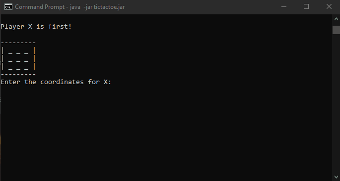

# SimpleTicTacToe 

## Demo
  
  

## Required Software

    Java 11 
    Maven  

## Build & Execute

At the root directory prompt, execute the following maven command:

    mvn clean package  

Change directory to the target directory and execute the following command:

    java -jar tictactoe.jar 
  
